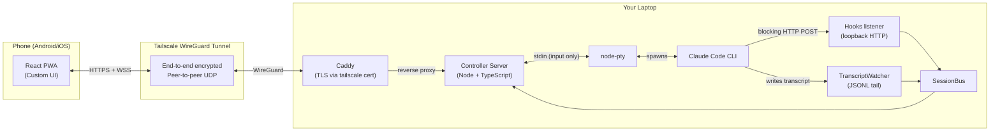
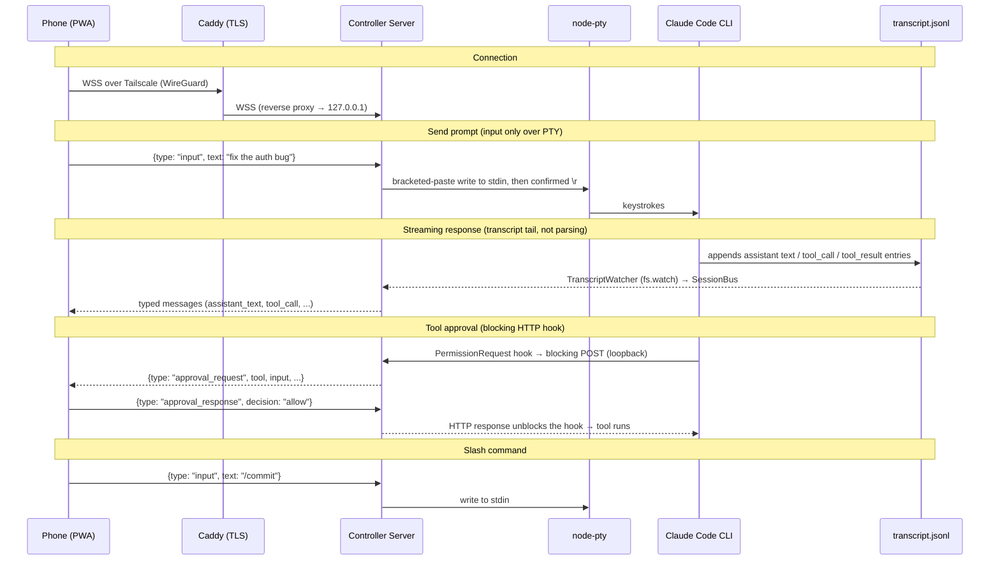
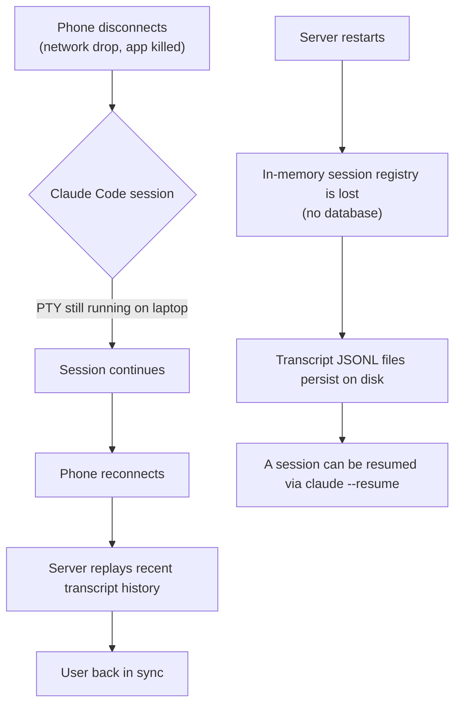
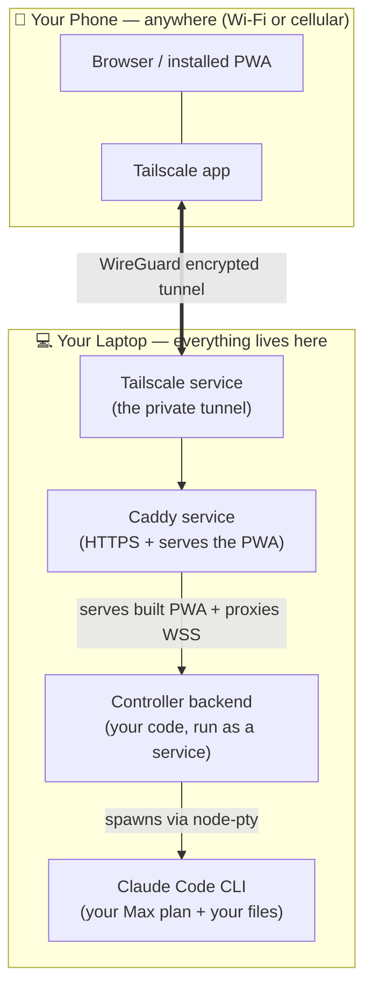
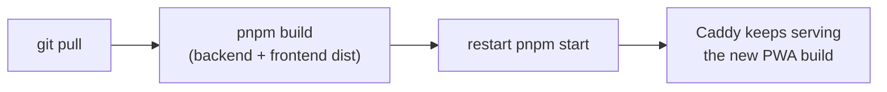
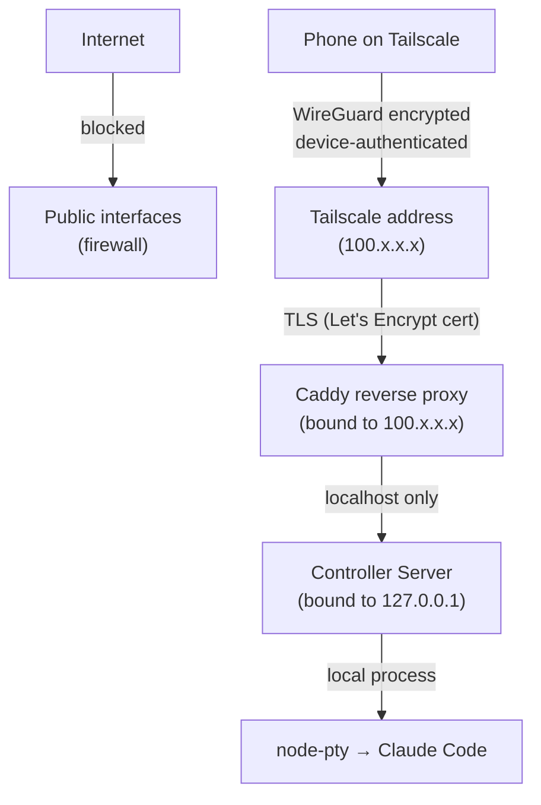

# Claude Controller

An advanced remote control system for Claude Code CLI sessions. Self-hosted, no database, no auth overhead — clone it, run it, control your sessions from anywhere.

## Why

Claude Code's native remote control is a simple chat relay. You can send messages and see responses, but you can't:

- Change permission modes mid-session
- Run slash commands
- Spawn or manage multiple sessions
- Approve tool requests with one tap
- See real-time session metadata
- Undo actions or view diffs before approving

Claude Controller is a full control plane for Claude Code sessions.

---

## Features

### Core Session Control

- **Switch permission modes** mid-session (default / acceptEdits / plan / auto / bypassPermissions)
- **Run slash commands** (/commit, /review-pr, /compact, etc.)
- **Spawn new sessions** with configurable working directory, permission mode, and model
- **Kill / pause / resume** sessions
- **Switch models** mid-session (Opus, Sonnet, Haiku)

### Session Management

- **Dashboard** — all active sessions with status, token usage, current task, working directory
- **Session naming & tagging**
- **Session history** — browse and resume past sessions

### Tool & Permission Control

- **One-tap tool approval queue** — pending permission requests, approve/deny instantly
- **Tool allow/deny lists** — editable per session
- **Audit log** — tools ran, files modified, commands executed

### Monitoring

- **Live streaming output** — real-time response rendering
- **Statusline metadata** — model, token count, cost, context usage, session duration
- **File diff viewer** — see changes before approving
- **Terminal output viewer** — bash command results
- **Push notifications** — task complete, permission needed, error, budget threshold hit

### Configuration

- **Per-project profiles** — default permission mode, allowed tools, model, CLAUDE.md overrides
- **Global settings** — default model, budget limits, notification preferences
- **MCP server list** — read-only view of available servers from config

---

## Key Decisions Made

- **No Agent SDK** — requires API keys with pay-per-token billing. Cannot use Max plan credits. One user got $1,800 in surprise charges in 2 days.
- **No Vercel AI SDK** — it calls LLM APIs directly. We don't call Claude's API ourselves — we control the CLI which does that internally.
- **Anthropic's third-party restrictions don't affect us** — the crackdown (Jan-Apr 2026) targeted tools piggybacking on claude.ai OAuth subscriptions. We control a local CLI process authenticated by the user's own login.
- **Not OpenClaw/NemoClaw** — those call LLM APIs through a multi-engine platform. We type into a terminal. From Anthropic's perspective, we're indistinguishable from you sitting at your keyboard.
- **pnpm monorepo** (3 packages: `backend`, `frontend`, `common`) for package management
- **No database** — in-memory state; sessions don't survive a backend restart (transcripts persist on disk)
- **Undo feature deferred** — not in initial scope
- **Approach A (Direct PTY)** — 3-entity SSH bridge rejected. If WSS+token is compromised, SSH keys on the same machine are likely compromised too. SSH adds setup burden without meaningful security gain for same-machine deployment.

---

## Architecture

### Core Principle: Terminal Relay with Custom UI

Instead of calling Claude's API ourselves (which costs extra money via API billing), we control the **actual Claude Code CLI process**. From Anthropic's perspective, we're indistinguishable from you sitting at your keyboard. This means:

- Uses your existing Max plan credits
- All CLI features work automatically (slash commands, permissions, etc.)
- Future CLI updates get picked up for free

Our server spawns Claude Code in a PTY and consumes **two structured data sources** — never by scraping the terminal:

1. **HTTP hooks.** The CLI is launched with a `--settings` JSON that registers blocking hooks (`PermissionRequest` for tool approvals + AskUserQuestion, `PreCompact`/`PostCompact` for compaction) which POST to a loopback-only endpoint. A blocked hook holds the CLI until the phone responds, which is how one-tap approvals work.
2. **Transcript JSONL.** Claude Code writes a structured per-session transcript at `~/.claude/projects/<encoded-cwd>/<session-id>.jsonl`. We tail this file for all content — assistant text, tool calls, tool results, user prompts.

Both sources normalize into a per-session **SessionBus**, which is forwarded as typed JSON messages to a custom React PWA on your phone. **PTY stdin is used for input only**; PTY stdout is dumped to a `.raw` file for debugging and is never parsed.

### Security & Transport: Tailscale + Caddy (Not Ours to Build)

We don't reinvent network security. We delegate it to battle-tested tools:

- **[Tailscale](https://tailscale.com)** — WireGuard-based mesh VPN. Peer-to-peer, end-to-end encrypted. Free for personal use. Handles NAT traversal, device approval, ACLs, key rotation.
- **[Caddy](https://caddyserver.com)** — Reverse proxy that terminates TLS using Tailscale-provisioned Let's Encrypt certs. Real green padlock, no self-signed cert warnings.
- **Bound to the Tailscale address only** — Caddy listens on the machine's Tailscale IP (`100.x.x.x`, assigned by Tailscale on every OS), and the backend listens only on `localhost`. Neither faces the public internet or your LAN, so there's no firewall configuration to get wrong.

This gives us SSH-grade security without SSH: WireGuard encryption (ChaCha20-Poly1305), mutual device authentication, and Tailscale's ACL system — all maintained by dedicated security teams.

### System Diagram



### Data Flow



### Session Persistence



### What We Build vs What We Reuse

| Component | Build or Reuse | Notes |
|-----------|---------------|-------|
| **Transport encryption** | Reuse (Tailscale/WireGuard) | Peer-to-peer, end-to-end encrypted |
| **TLS termination** | Reuse (Caddy + tailscale cert) | Real Let's Encrypt certs for tailnet hostnames |
| **Device auth & ACLs** | Reuse (Tailscale) | Device approval, tailnet lock, ACLs |
| **Structured CLI signals** | Reuse (Claude Code hooks + transcript JSONL) | No scraping — the CLI emits both |
| **Controller Server** | **Build** | Spawns PTY, runs the hooks listener, tails transcripts, relays I/O |
| **Hooks + transcript ingestion** | **Build** | Normalizes HTTP hooks + JSONL tail into a typed SessionBus |
| **React PWA** | **Build** | Custom mobile UI with approval cards, dashboard, command palette |

---

## How It Runs (Where Everything Lives)

The single most important thing to understand: **there is no cloud. Everything runs on your own laptop.** Your phone is just a browser — it stores none of your code or data.

This isn't a deployment *choice* — it's forced by the design. The controller spawns the **actual Claude Code CLI** as a child process and reads your local files and your `~/.claude` login. That can only happen on the machine where Claude Code lives: yours. So "where do I deploy the server?" has a simple answer — **the same laptop you already code on.**

### What you install, and where

| 💻 On your laptop | 📱 On your phone |
|-------------------|------------------|
| **Tailscale** — the private tunnel | **Tailscale app** — joins the same private network |
| **Caddy** — serves the PWA + HTTPS | **A browser** — loads the app (and can "install" it as a PWA) |
| **Controller backend** (this project) — spawns Claude Code, relays I/O | *that's it — nothing of yours is stored here* |
| **Claude Code CLI** — the thing being controlled | |

The phone holds nothing. It's a window into the laptop, opened over a private, encrypted tunnel.

### Tailscale & Caddy are installed software — not npm packages

This trips people up, so it's worth stating plainly:

| Piece | What it actually is | How you get it |
|-------|---------------------|----------------|
| **Tailscale** | An OS-level VPN that creates a *virtual network interface* (that's where the `100.x.x.x` address comes from) and runs as a background service | Download the installer from tailscale.com (laptop) + install the app (phone) |
| **Caddy** | A standalone reverse-proxy / web server you run as a service | Download the binary / installer |
| **Controller + PWA** | This project (the only part that's npm/pnpm) | `git clone` → `pnpm install` → `pnpm build` |

Why can't Tailscale just be an npm dependency? Because it creates network interfaces and encrypted tunnels at the **operating-system level** — something a package running *inside* your Node process can't do. Your app never imports Tailscale or Caddy; they're plumbing that sits *underneath* it. **Your `package.json` doesn't change for any of this.**

### Topology



### What "deploying" means here

There's no remote box to push to and no CI/CD pipeline. "Deploying" means two things on your laptop:

1. **Run it as a durable service** — wrap `pnpm start` (which otherwise runs in your terminal) so the backend + Caddy **start on boot and survive sleep**. This is the one genuinely fiddly part (Windows service via NSSM, a Scheduled Task, or pm2).
2. **Update in place** when you change the code:



Two consequences worth knowing up front:

- **One controller per machine that has Claude Code.** Want to control both a laptop and a desktop? Each runs its own Tailscale + Caddy + backend + Claude Code. The phone can reach both over the tailnet.
- **The laptop must be awake and online** for the phone to reach it. There's no always-on cloud server absorbing that — which is the deliberate trade-off for using your own Max plan credits on your own machine.

---

## Getting Started

### Prerequisites

- **Node + pnpm**, and the **Claude Code CLI** installed and logged in (the controller drives your local CLI).
- **Tailscale** on the laptop and phone, signed into the same account. In the tailnet admin (`login.tailscale.com/admin/dns`): enable **MagicDNS** and **HTTPS Certificates**.
- **Caddy ≥ 2.5** installed and on `PATH` (Windows: `winget install CaddyServer.Caddy`; macOS: `brew install caddy`).

### 1. Install & build

```bash
pnpm install
pnpm build
```

### 2. Configure environment

Two `.env` files (both gitignored) — backend config lives with the backend, deploy/Caddy config at the root. Copy the examples and fill them in:

```bash
cp packages/backend/.env.example packages/backend/.env   # backend vars
cp .env.example .env                                      # deploy / Caddy vars
```

Find this machine's values:

```bash
tailscale ip -4           # -> TAILSCALE_IP   (e.g. 100.x.x.x)
tailscale status --json   # Self.DNSName -> CONTROLLER_HOST (drop the trailing dot)
```

Minimum to set: `CONTROLLER_HOST` + `TAILSCALE_IP` (root `.env`), and `NODE_ENV=production` + `ALLOWED_ORIGINS=https://<your-host>.ts.net` (backend `.env`). Full list in [Environment variables](#environment-variables).

### 3. Run

```bash
pnpm start
```

This launches the backend + Caddy together (Ctrl+C stops both). On your phone (Tailscale **on**), open `https://<your-host>.ts.net` — green padlock + the PWA. Use the browser's **Install / Add to Home screen** for the app-like, fullscreen launch.

### Updating

`git pull` → `pnpm build` → restart `pnpm start`. (Caddy serves the frontend `dist` live, so a frontend-only change just needs `pnpm build:frontend` — no restart.)

### Changing the app icon

The home-screen icon is generated from `packages/frontend/scripts/icon-source.png`. Replace that file (any square PNG), then:

```bash
pnpm --filter frontend generate:icons   # -> public/icon-{192,512}.png + apple-touch-icon.png
pnpm build:frontend
```

### Environment variables

**Backend** — `packages/backend/.env` (loaded by the backend via `dotenv`):

| Var | Required | Default | Description |
|-----|----------|---------|-------------|
| `NODE_ENV` | for remote | dev | Set to `production` to **fail closed**: the WS/CORS origin check rejects any origin not in `ALLOWED_ORIGINS` (and any request with no `Origin`). Leave unset for local dev (localhost auto-allowed). |
| `ALLOWED_ORIGINS` | in prod | — | Comma-separated allowed browser origins, e.g. `https://laptop.tailnet.ts.net`. |
| `HOST` | no | `127.0.0.1` | Bind address. **Loopback only** — Caddy is the sole process facing the tailnet; never `0.0.0.0`. |
| `PORT` | no | `4577` | Backend port. |
| `HOOKS_PORT` | no | `0` (auto) | Loopback hooks-listener port. `0` lets the OS pick a free port (collision-proof); set a number to pin it. |
| `LOG_LEVEL` | no | all | Comma-separated levels to emit (`debug,info,warn,error`). |
| `DATA_DIR` / `DUMP_DIR` | no | `./data` / `./dump` | Session capture / debug-dump directories. |
| `PTY_COLS` / `PTY_ROWS` | no | `120` / `40` | PTY size for the spawned CLI. |

**Deploy / Caddy** — root `.env` (loaded by `scripts/start.ts`, passed to Caddy):

| Var | Required | Default | Description |
|-----|----------|---------|-------------|
| `CONTROLLER_HOST` | yes | — | Your tailnet hostname (`*.ts.net`). Caddy's site address **and** the name it fetches the TLS cert for. |
| `TAILSCALE_IP` | yes | — | This machine's Tailscale IP. Caddy binds **only** here, so the PWA never appears on the LAN or public internet. |
| `BACKEND_ADDR` | no | `127.0.0.1:4577` | Where Caddy proxies `/ws` + `/health`. |
| `FRONTEND_DIST` | no | `./packages/frontend/dist` | Path to the built PWA that Caddy serves. |

---

## Security Model

### What We're Protecting

Your personal machine with full filesystem access, potentially running Claude Code in `bypassPermissions` mode.

### Security Layers (Defense in Depth)



1. **Network level:** Server bound to Tailscale interface only. Public internet can't reach it.
2. **VPN level:** Tailscale requires device authentication. Only your approved devices can connect.
3. **TLS level:** Caddy terminates TLS with real certs. Encrypted even within the tailnet.
4. **Application level:** Server validates WebSocket origin headers, enforces CSP.

### Tailscale Hardening (from reference doc)

- **2FA** on the identity provider (TOTP / Google Authenticator). Highest-leverage single control. FIDO2 hardware keys are stronger but overkill for personal use.
- **Tailnet lock** — new devices must be signed by an existing trusted device.
- **ACLs** — only allow phone → laptop on the controller server port.
- **Device approval** — manually approve new devices joining the tailnet.
- **Key expiry** — keep default 180-day expiry.

### Risks That Exist Regardless (Claude Code's own surface)

These apply whether you use our tool, SSH, or sit at your laptop:

- Prompt injection via Claude's output
- Terminal escape sequences
- Keystroke interception (keyloggers)
- Resource exhaustion from spawning processes

**Our tool does NOT increase these risks.** They are inherited from Claude Code itself.

### Ingestion Security

- The controller NEVER auto-acts — approvals and AskUserQuestion answers require explicit input from the phone. A blocking hook simply holds the CLI until the user responds.
- Ingestion is read-only: tailing the transcript JSONL and receiving hook POSTs presents information; it never synthesizes actions on its own. The one exception is the AskUserQuestion keystroke relay, which only fires in response to an explicit answer from the phone.
- The hooks listener is **loopback-only** (`127.0.0.1`) — Claude Code's SSRF guard blocks POSTs to private IPs, and there's no reason for that endpoint to be reachable over the network.
- CLI updates changing the JSONL entry shape or hook payload schema can break ingestion (maintenance burden, not a security risk).

### Phone as Weakest Link

If the phone is unlocked and stolen, the attacker has Tailscale access and potentially a live session. Mitigations:

- Strong device passcode (not just biometric)
- Short auto-lock timeout
- Remote wipe configured
- PWA session timeout (auto-disconnect after idle period)

---

## Tech Stack

| Layer | Choice | Rationale |
|-------|--------|-----------|
| **Runtime** | Node.js | Required by `node-pty`; CLI spawned as a child process |
| **Monorepo** | pnpm workspaces | 3 packages — `backend`, `frontend`, `common` |
| **Lint/format** | Biome | Single tool, no ESLint/Prettier |
| **PTY** | node-pty | VS Code uses it, the standard |
| **WebSocket** | ws | Fast, well-maintained |
| **Frontend** | React 19 + Vite | Fast dev, good PWA support |
| **Styling** | Tailwind CSS 4 | Mobile-responsive out of the box |
| **Transport** | Tailscale (user-provided) | WireGuard VPN, free personal tier |
| **TLS** | Caddy (user-provided) | Auto-certs via tailscale cert |
| **State** | In-memory | No database; transcripts persist on disk via the CLI |

### Core Packages

| Package | Purpose |
|---------|---------|
| **[node-pty](https://npmjs.com/package/node-pty)** | Spawn Claude Code in a PTY |
| **[ws](https://npmjs.com/package/ws)** | WebSocket server |

### Reference Implementations

| Tool | What we learn from it |
|------|----------------------|
| **[ttyd](https://github.com/tsl0922/ttyd)** | Web terminal bound to specific interface, auth patterns |
| **[Wetty](https://github.com/butlerx/wetty)** | Node.js + xterm.js + WebSocket architecture |
| **[GoTTY](https://github.com/sorenisanerd/gotty)** | Random URL security, read-only defaults |

---

## Roadmap

What's built and working today: session control, the hardened Tailscale + Caddy
transport, one-tap tool approvals, the AskUserQuestion relay, slash-command
*sending*, model/effort/mode switching, and the installable PWA. What's next:

### Interactive features

- **Plan approval (ExitPlanMode)** — render the plan on the phone and choose
  approve / approve + auto-accept edits / keep planning. Reuses the
  AskUserQuestion picker-driving + confirm machinery.
- **Slash-command discovery** — a `/` autocomplete menu listing built-in +
  project + plugin commands with their args. (Sending already works; the
  discovery UI is the missing half.)
- **Subagents (agents) view** — nested, collapsible rendering of `Task`-spawned
  subagents so a fanned-out run stays legible on a phone.
- **File-diff rendering** — mobile-friendly diffs for `Edit`/`Write` in the tool
  cards (currently shown as raw tool I/O).
- **Image / attachment send** — snap or paste a screenshot straight into a
  session (phones are camera-first).
- *Internal:* a shared "drive-an-ink-picker + confirm" helper to de-risk the
  timing-fragile keystroke flows that plan approval and the slash menu inherit.

### Multi-session

- **Attention routing** — fast session switching plus a badge when a backgrounded
  session needs input (a pending question or approval).

### Reliability

- **Run as a durable service** — wrap `pnpm start` so the backend + Caddy start on
  boot and survive sleep (Windows service via NSSM, a logon Scheduled Task, or
  pm2). The launcher exists; boot-persistence doesn't yet.
- **Session-registry persistence** — state is in-memory, so a backend restart
  loses the session list (transcripts persist on disk; the subscribe path can
  disk-discover a single session). A small persisted registry removes the
  "restarted and my sessions vanished" cliff.
- **Adaptive history replay** — the reconnect replays only the recent transcript
  tail; long sessions need a bigger or adaptive window before the user scrolls.

### Hardening (optional)

- **Tailnet lock + device approval** in the Tailscale admin (2FA + HTTPS certs
  already enabled).
- **PWA idle timeout** — auto-disconnect after inactivity (phone-as-weakest-link
  mitigation).

### Considered, not planned

- **Push notifications** — would be the single biggest multiplier for hands-off
  use, but explicitly **out of scope** for now per current direction.
