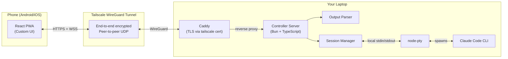
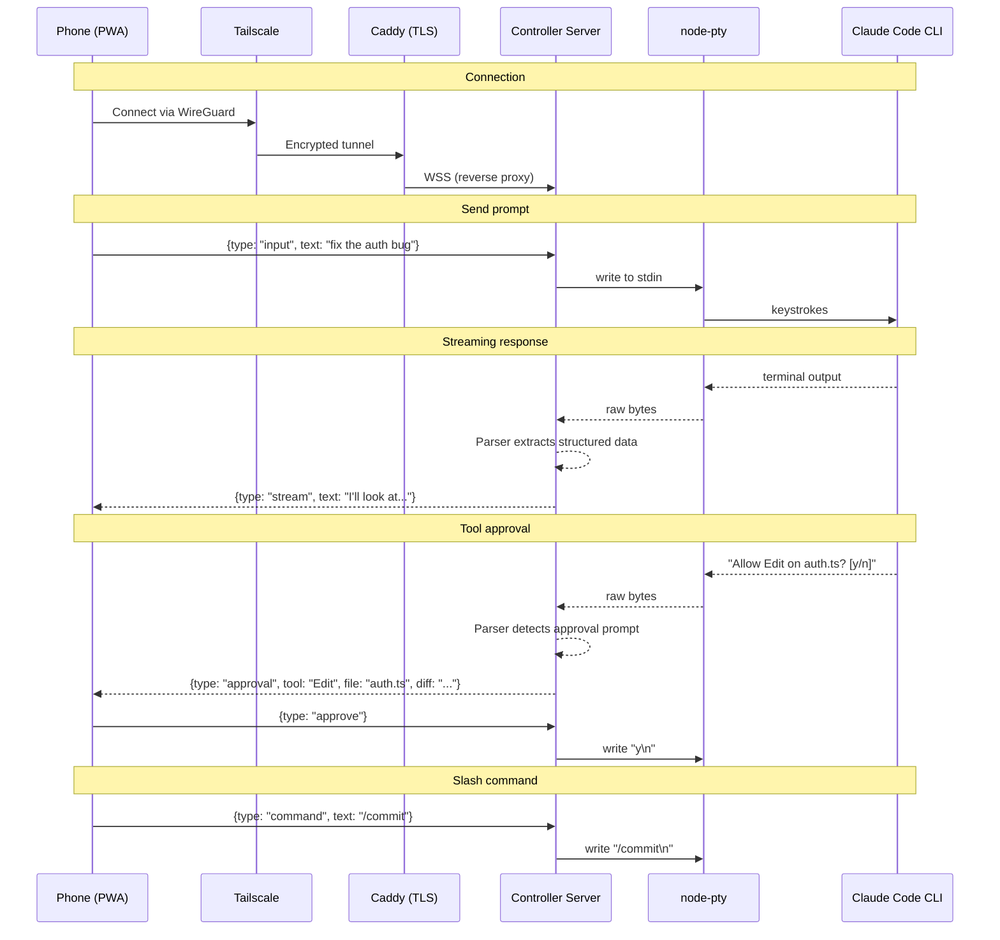
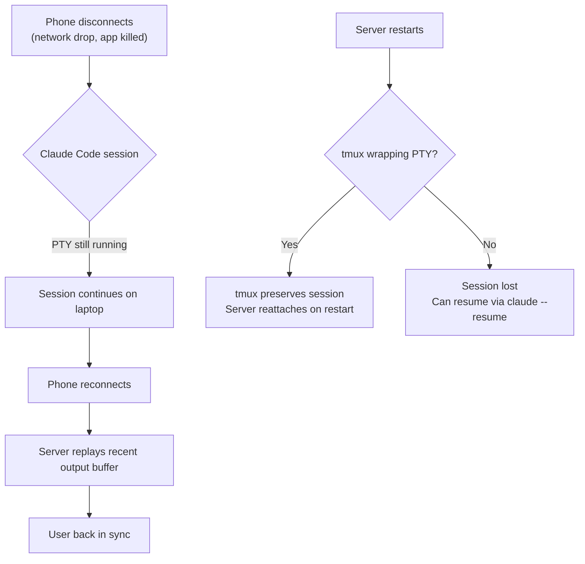
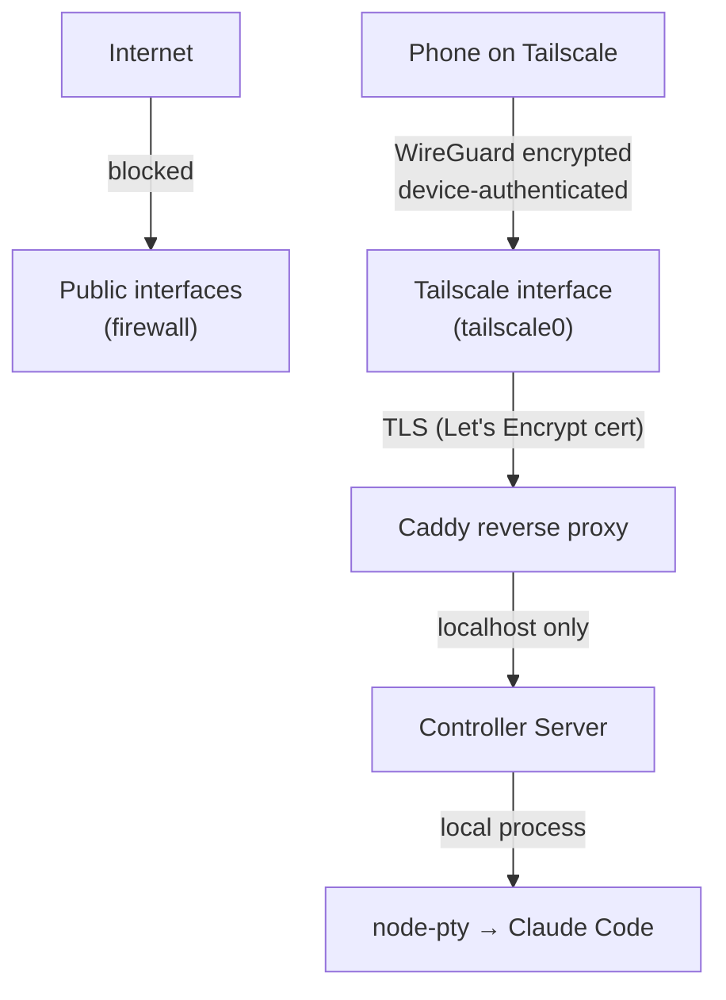

# Claude Controller

An advanced remote control system for Claude Code CLI sessions. Self-hosted, no database, no auth overhead — clone it, run it, control your sessions from anywhere.

## Why

Claude Code's native remote control is a simple chat relay. You can send messages and see responses, but you can't:

- Change permission modes mid-session
- Run slash commands
- Spawn or manage multiple sessions
- Approve tool requests with one tap
- See real-time session metadata
- Undo actions or view diffs before approving

Claude Controller is a full control plane for Claude Code sessions.

---

## Features

### Core Session Control

- **Switch permission modes** mid-session (default / acceptEdits / plan / auto / bypassPermissions)
- **Run slash commands** (/commit, /review-pr, /compact, etc.)
- **Spawn new sessions** with configurable working directory, permission mode, and model
- **Kill / pause / resume** sessions
- **Switch models** mid-session (Opus, Sonnet, Haiku)

### Session Management

- **Dashboard** — all active sessions with status, token usage, current task, working directory
- **Session naming & tagging**
- **Session history** — browse and resume past sessions

### Tool & Permission Control

- **One-tap tool approval queue** — pending permission requests, approve/deny instantly
- **Tool allow/deny lists** — editable per session
- **Audit log** — tools ran, files modified, commands executed

### Monitoring

- **Live streaming output** — real-time response rendering
- **Statusline metadata** — model, token count, cost, context usage, session duration
- **File diff viewer** — see changes before approving
- **Terminal output viewer** — bash command results
- **Push notifications** — task complete, permission needed, error, budget threshold hit

### Configuration

- **Per-project profiles** — default permission mode, allowed tools, model, CLAUDE.md overrides
- **Global settings** — default model, budget limits, notification preferences
- **MCP server list** — read-only view of available servers from config

---

## Key Decisions Made

- **No Agent SDK** — requires API keys with pay-per-token billing. Cannot use Max plan credits. One user got $1,800 in surprise charges in 2 days.
- **No Vercel AI SDK** — it calls LLM APIs directly. We don't call Claude's API ourselves — we control the CLI which does that internally.
- **Anthropic's third-party restrictions don't affect us** — the crackdown (Jan-Apr 2026) targeted tools piggybacking on claude.ai OAuth subscriptions. We control a local CLI process authenticated by the user's own login.
- **Not OpenClaw/NemoClaw** — those call LLM APIs through a multi-engine platform. We type into a terminal. From Anthropic's perspective, we're indistinguishable from you sitting at your keyboard.
- **Bun monorepo** for package management
- **No database** — flat files or in-memory state
- **Undo feature deferred** — not in initial scope
- **Approach A (Direct PTY)** — 3-entity SSH bridge rejected. If WSS+token is compromised, SSH keys on the same machine are likely compromised too. SSH adds setup burden without meaningful security gain for same-machine deployment.

---

## Architecture

### Core Principle: Terminal Relay with Custom UI

Instead of calling Claude's API ourselves (which costs extra money via API billing), we control the **actual Claude Code CLI process**. From Anthropic's perspective, we're indistinguishable from you sitting at your keyboard. This means:

- Uses your existing Max plan credits
- All CLI features work automatically (slash commands, permissions, etc.)
- Future CLI updates get picked up for free

Our server spawns Claude Code in a PTY, **parses its terminal output** into structured data (approvals, diffs, metadata, streaming text), and sends JSON to a custom React PWA on your phone.

### Security & Transport: Tailscale + Caddy (Not Ours to Build)

We don't reinvent network security. We delegate it to battle-tested tools:

- **[Tailscale](https://tailscale.com)** — WireGuard-based mesh VPN. Peer-to-peer, end-to-end encrypted. Free for personal use. Handles NAT traversal, device approval, ACLs, key rotation.
- **[Caddy](https://caddyserver.com)** — Reverse proxy that terminates TLS using Tailscale-provisioned Let's Encrypt certs. Real green padlock, no self-signed cert warnings.
- **Server binds to Tailscale interface only** (`tailscale0`) — invisible to public internet. No firewall configuration needed.

This gives us SSH-grade security without SSH: WireGuard encryption (ChaCha20-Poly1305), mutual device authentication, and Tailscale's ACL system — all maintained by dedicated security teams.

### System Diagram

### Data Flow

### Session Persistence

### What We Build vs What We Reuse

| Component | Build or Reuse | Notes |
|-----------|---------------|-------|
| **Transport encryption** | Reuse (Tailscale/WireGuard) | Peer-to-peer, end-to-end encrypted |
| **TLS termination** | Reuse (Caddy + tailscale cert) | Real Let's Encrypt certs for tailnet hostnames |
| **Device auth & ACLs** | Reuse (Tailscale) | Device approval, tailnet lock, ACLs |
| **Session persistence** | Reuse (tmux) | Survives network drops and server restarts |
| **Controller Server** | **Build** | Spawns PTY, manages sessions, relays I/O |
| **Output Parser** | **Build** | Extracts approvals, diffs, metadata from terminal output |
| **React PWA** | **Build** | Custom mobile UI with approval cards, dashboard, command palette |

---

## Security Model

### What We're Protecting

Your personal machine with full filesystem access, potentially running Claude Code in `bypassPermissions` mode.

### Security Layers (Defense in Depth)

1. **Network level:** Server bound to Tailscale interface only. Public internet can't reach it.
2. **VPN level:** Tailscale requires device authentication. Only your approved devices can connect.
3. **TLS level:** Caddy terminates TLS with real certs. Encrypted even within the tailnet.
4. **Application level:** Server validates WebSocket origin headers, enforces CSP.

### Tailscale Hardening (from reference doc)

- **2FA** on the identity provider (TOTP / Google Authenticator). Highest-leverage single control. FIDO2 hardware keys are stronger but overkill for personal use.
- **Tailnet lock** — new devices must be signed by an existing trusted device.
- **ACLs** — only allow phone → laptop on the controller server port.
- **Device approval** — manually approve new devices joining the tailnet.
- **Key expiry** — keep default 180-day expiry.

### Risks That Exist Regardless (Claude Code's own surface)

These apply whether you use our tool, SSH, or sit at your laptop:

- Prompt injection via Claude's output
- Terminal escape sequences
- Keystroke interception (keyloggers)
- Resource exhaustion from spawning processes

**Our tool does NOT increase these risks.** They are inherited from Claude Code itself.

### Parser Security

- Parser must NEVER auto-act — all actions require explicit user input from the phone
- Parser is read-only: it presents information, never executes commands on its own
- If parser can't identify a pattern, it falls back to showing raw terminal output
- CLI updates changing output format can break the parser (maintenance burden, not a security risk)

### Phone as Weakest Link

If the phone is unlocked and stolen, the attacker has Tailscale access and potentially a live session. Mitigations:

- Strong device passcode (not just biometric)
- Short auto-lock timeout
- Remote wipe configured
- PWA session timeout (auto-disconnect after idle period)

---

## Tech Stack

| Layer | Choice | Rationale |
|-------|--------|-----------|
| **Runtime** | Bun | Fast, TypeScript-native, built-in test runner |
| **Monorepo** | Bun workspaces | Simple, no extra tooling |
| **PTY** | node-pty | VS Code uses it, the standard |
| **WebSocket** | ws | Fast, well-maintained |
| **Frontend** | React + Vite | Fast dev, good PWA support |
| **Styling** | Tailwind CSS | Mobile-responsive out of the box |
| **Transport** | Tailscale (user-provided) | WireGuard VPN, free personal tier |
| **TLS** | Caddy (user-provided) | Auto-certs via tailscale cert |
| **Session persistence** | tmux (user-provided) | Battle-tested, survives everything |
| **State** | JSON flat files + in-memory | No database |

### Core Packages

| Package | Purpose |
|---------|---------|
| **[node-pty](https://npmjs.com/package/node-pty)** | Spawn Claude Code in a PTY |
| **[ws](https://npmjs.com/package/ws)** | WebSocket server |
| **[xterm.js](https://github.com/xtermjs/xterm.js)** | Terminal fallback view (raw mode) |
| **[helmet](https://npmjs.com/package/helmet)** | HTTP security headers |

### Reference Implementations

| Tool | What we learn from it |
|------|----------------------|
| **[ttyd](https://github.com/tsl0922/ttyd)** | Web terminal bound to specific interface, auth patterns |
| **[Wetty](https://github.com/butlerx/wetty)** | Node.js + xterm.js + WebSocket architecture |
| **[GoTTY](https://github.com/sorenisanerd/gotty)** | Random URL security, read-only defaults |

---

## Open Questions

1. **Output parser strategy** — How do we reliably parse Claude Code's terminal output? Regex patterns? ANSI escape sequence analysis? Need to study the CLI's output format in depth first.
2. **Background process** — Server needs to survive laptop sleep/lock. Options: system service, `pm2`, or Bun's built-in process management.
3. **Fallback mode** — When the parser can't understand the output, fall back to raw xterm.js terminal view.
