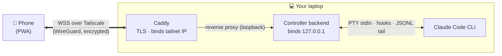

<p align="center">
  
</p>

<h1 align="center">Claude Controller</h1>

<p align="center">
  <strong>Run Claude Code from your phone — over your own private, encrypted tunnel.</strong>
</p>

<p align="center">
  No cloud · no database · no API billing · your Claude credits, your machine.
</p>

---

Claude Controller spawns the real **Claude Code CLI** on your machine and relays it to a custom mobile PWA over a [Tailscale](https://tailscale.com) tunnel. From your phone you drive sessions, approve tool requests with one tap, switch model/mode mid-run, and send slash commands — all on your own Max-plan credits (it never calls the paid API).

Claude Code's built-in remote is a chat relay. This is a full control plane:

- **Switch permission modes** mid-session (default / acceptEdits / plan / auto / bypassPermissions)
- **One-tap tool approvals** — pending requests, approve or deny instantly
- **Spawn / resume sessions** and browse recent chats per project
- **Switch model + effort** mid-session (Opus / Sonnet / Haiku)
- **Send slash commands** and structured AskUserQuestion answers
- **Live status** — model, tokens, cost, context, duration
- **Installable PWA** — fullscreen, home-screen launch

> Everything runs on **your** laptop; the phone is just an encrypted window into it. See the [Roadmap](#roadmap) for what's next.

## Quick start

### Prerequisites

- **Node + pnpm**, and the **Claude Code CLI** installed and logged in (the controller drives your local CLI).
- **[Tailscale](https://tailscale.com/download)** on the laptop **and** phone, signed into the same account. In the tailnet admin (`login.tailscale.com/admin/dns`) enable **MagicDNS** and **HTTPS Certificates**.
- **[Caddy](https://caddyserver.com/docs/install) ≥ 2.5** on `PATH` (Windows: `winget install CaddyServer.Caddy`; macOS: `brew install caddy`).

### 1. Install & build

```bash
pnpm install
pnpm build
```

### 2. Configure

Two `.env` files (both gitignored) — backend config in the backend package, Caddy config at the root:

```bash
cp packages/backend/.env.example packages/backend/.env   # backend vars
cp .env.example .env                                     # Caddy vars (root)
```

Find this machine's values and fill them in:

```bash
tailscale ip -4           # -> TAILSCALE_IP (e.g. 100.x.x.x)
tailscale status --json   # Self.DNSName -> CONTROLLER_HOST (drop the trailing dot)
```

At minimum set `CONTROLLER_HOST` + `TAILSCALE_IP` (root `.env`) and `NODE_ENV=production` + `ALLOWED_ORIGINS=https://<your-host>.ts.net` (backend `.env`). Full reference below.

### 3. Run

```bash
pnpm start
```

Launches the backend + Caddy together (Ctrl+C stops both). On your phone (Tailscale **on**), open `https://<your-host>.ts.net` — green padlock, the PWA loads. Use the browser's **Install / Add to Home screen** for the fullscreen app.

**Updating:** `git pull` → `pnpm build` → restart `pnpm start`. (Caddy serves the frontend `dist` live, so a frontend-only change just needs `pnpm build:frontend`.)

## Configuration

**Backend** — `packages/backend/.env` (loaded by the backend via `dotenv`; template: [`packages/backend/.env.example`](packages/backend/.env.example)):

| Var | Required | Default | Description |
|-----|----------|---------|-------------|
| `NODE_ENV` | for remote | dev | Set to `production` to **fail closed**: the WS/CORS origin check rejects any origin not in `ALLOWED_ORIGINS` (and any request with no `Origin`). Leave unset for local dev (localhost auto-allowed). |
| `ALLOWED_ORIGINS` | in prod | — | Comma-separated allowed browser origins, e.g. `https://laptop.tailnet.ts.net`. |
| `HOST` | no | `127.0.0.1` | Bind address. **Loopback only** — Caddy is the sole process facing the tailnet; never `0.0.0.0`. |
| `PORT` | no | `4577` | Backend port. |
| `HOOKS_PORT` | no | `0` (auto) | Loopback hooks-listener port. `0` lets the OS pick a free port (collision-proof); set a number to pin it. |
| `LOG_LEVEL` | no | all | Comma-separated levels to emit (`debug,info,warn,error`). |
| `DUMP_DIR` | no | `./dump` | Debug-dump directory (PTY `.raw` captures, statusline payloads). |
| `PTY_COLS` | no | `120` | PTY width for the spawned CLI. |
| `PTY_ROWS` | no | `40` | PTY height for the spawned CLI. |

**Caddy** — root `.env` (loaded by `scripts/start.ts`, passed to Caddy; template: [`.env.example`](.env.example)):

| Var | Required | Default | Description |
|-----|----------|---------|-------------|
| `CONTROLLER_HOST` | yes | — | Your tailnet hostname (`*.ts.net`). Caddy's site address **and** the name it fetches the TLS cert for. |
| `TAILSCALE_IP` | yes | — | This machine's Tailscale IP. Caddy binds **only** here, so the PWA never appears on the LAN or public internet. |
| `BACKEND_ADDR` | no | `127.0.0.1:4577` | Where Caddy proxies `/ws` + `/health`. |
| `FRONTEND_DIST` | no | `./packages/frontend/dist` | Path to the built PWA that Caddy serves. |

## How it works

A **terminal relay**, not an API client. The controller spawns the CLI in a PTY and consumes two *structured* signals the CLI already emits — it never scrapes the terminal and never calls Claude's API:

- **Blocking HTTP hooks** (loopback) for tool approvals + AskUserQuestion and compaction. A blocked hook holds the CLI until your phone responds — that's how one-tap approval works.
- **The transcript JSONL** the CLI writes per session, tailed for all content (assistant text, tool calls/results, prompts).

Both normalize into a per-session **SessionBus**, forwarded as typed messages over WebSocket. PTY stdin carries your input; transport (encryption, TLS, device auth) is delegated to Tailscale + Caddy.



> Full internals — the hook contract, JSONL shape, the SessionBus, the AskUserQuestion keystroke relay, input confirmation, session persistence, and the design decisions — live in **[docs/architecture.md](docs/architecture.md)**.

## Architecture

A pnpm monorepo, three packages:

- **`packages/backend`** — Node runtime. Spawns the CLI via `node-pty`, runs the loopback hooks listener, tails the transcript, normalizes everything into a `SessionBus`, and serves the typed WebSocket protocol.
- **`packages/frontend`** — React 19 + Vite + Tailwind 4. Mobile-first PWA that renders structured message cards (assistant text, tool calls, approval/question cards).
- **`packages/common`** — shared TypeScript types for the WS protocol.

Deep dive: **[docs/architecture.md](docs/architecture.md)**.

## Security

Defense in depth — each layer reused from a battle-tested tool:

- **Device auth (Tailscale).** Only your approved devices join the tailnet; WireGuard (ChaCha20-Poly1305) end-to-end encryption, plus 2FA / tailnet lock / device approval.
- **Transport (Caddy).** Terminates TLS with a real Let's Encrypt cert for your `*.ts.net` host, **bound to the Tailscale IP only** — never the LAN or public internet.
- **Loopback backend.** The controller binds `127.0.0.1`; it's reachable *only* through Caddy. Nothing listens on `0.0.0.0` (verified by socket inspection).
- **Fail-closed origin check.** In production the WebSocket/CORS layer rejects any origin not in `ALLOWED_ORIGINS` (and any request with no `Origin`).
- **Read-only ingestion.** The controller never auto-acts — approvals/answers require explicit input from the phone; the hooks listener is loopback-only behind Claude Code's SSRF guard.

SSH-grade reach without exposing anything to the internet. Threat model, hardening checklist, and "risks that exist regardless" → **[docs/architecture.md#security](docs/architecture.md#security)**.

## Roadmap

What works today: session control, the hardened Tailscale + Caddy transport, one-tap tool approvals, the AskUserQuestion relay, slash-command *sending*, model/effort/mode switching, and the installable PWA. What's next:

### Interactive features

- **Plan approval (ExitPlanMode)** — render the plan on the phone and choose approve / approve + auto-accept edits / keep planning. Reuses the AskUserQuestion picker-driving + confirm machinery.
- **Slash-command discovery** — a `/` autocomplete menu listing built-in + project + plugin commands with their args. (Sending already works; discovery is the missing half.)
- **Subagents (agents) view** — nested, collapsible rendering of `Task`-spawned subagents so a fanned-out run stays legible on a phone.
- **File-diff rendering** — mobile-friendly diffs for `Edit`/`Write` in the tool cards (currently raw tool I/O).
- **Image / attachment send** — snap or paste a screenshot straight into a session.
- **File browser / viewer** — open and read actual project files from the phone, beyond the diffs shown in tool cards.
- **Port tunneling** — reach a dev server a session starts (e.g. `localhost:3000`) through the tunnel and open it on your phone.
- *Internal:* a shared "drive-an-ink-picker + confirm" helper to de-risk the timing-fragile keystroke flows that plan approval and the slash menu inherit.

### Multi-session

- **Attention routing** — fast session switching plus a badge when a backgrounded session needs input.

### Reliability

- **Run as a durable service** — wrap `pnpm start` so the backend + Caddy start on boot and survive sleep (Windows service via NSSM, a logon Scheduled Task, or pm2).
- **Session-registry persistence** — state is in-memory, so a backend restart loses the session list (transcripts persist on disk). A small persisted registry removes the "restarted and my sessions vanished" cliff.
- **Adaptive history replay** — the reconnect replays only the recent transcript tail; long sessions need a bigger/adaptive window.
- **Test suite** — to be built from scratch.

### Hardening (optional)

- **Tailnet lock + device approval** in the Tailscale admin (2FA + HTTPS certs already enabled).
- **PWA idle timeout** — auto-disconnect after inactivity.

---

## License

[MIT](LICENSE) © Yashvardhan Jagnani

