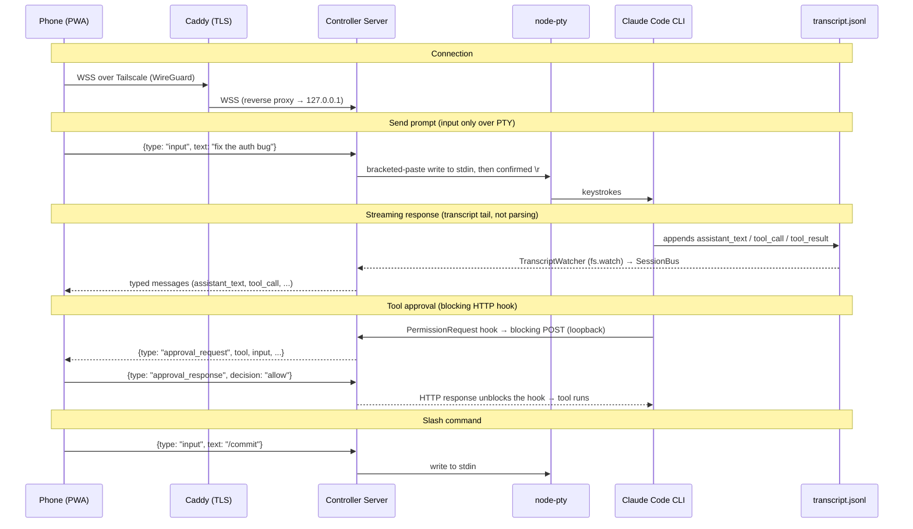
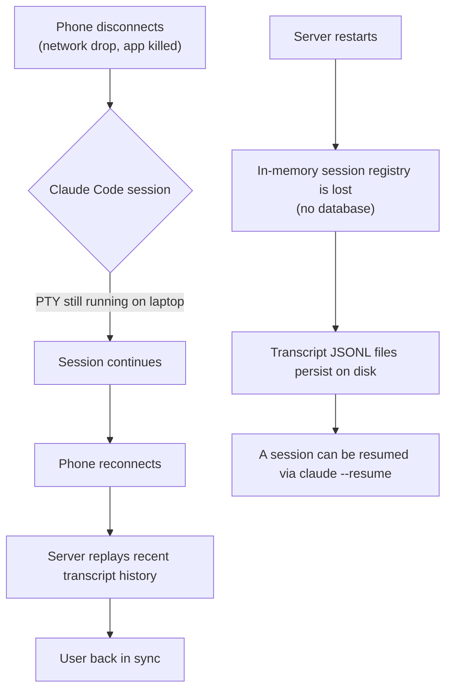
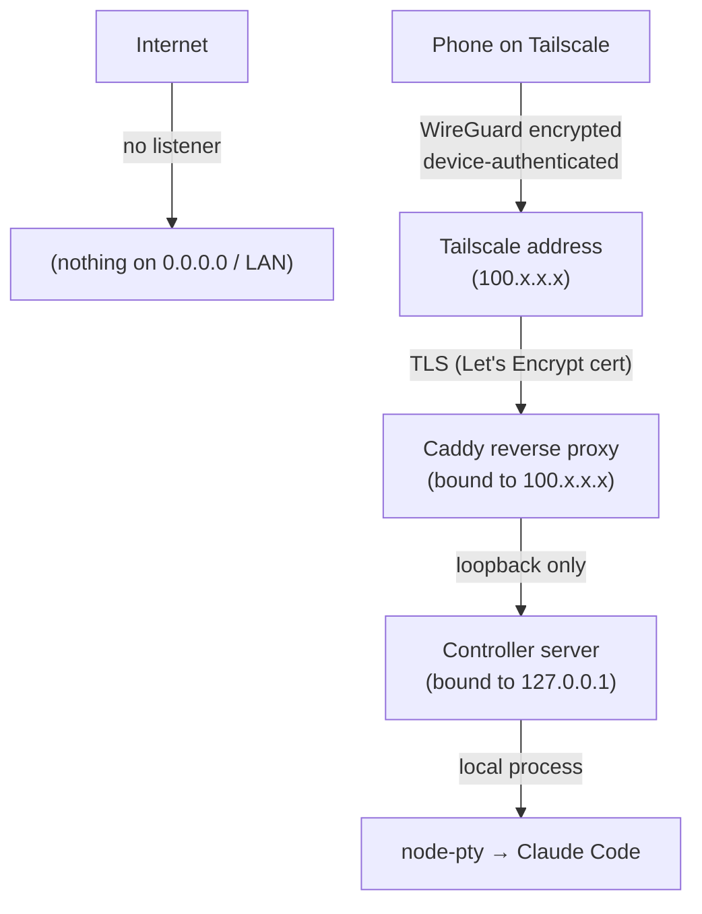

# Architecture (deep dive)

This is the excruciating-detail companion to the [README](../README.md). It covers
how the relay actually works, the wire protocol, the trickier subsystems, the
security model in full, and the decisions behind the design.

---

## Core principle: terminal relay, not an API client

Instead of calling Claude's API ourselves (which bills per token), we control the
**actual Claude Code CLI process**. From Anthropic's perspective we're
indistinguishable from you sitting at your keyboard. Consequences:

- Uses your existing **Max-plan credits** — no API key, no pay-per-token.
- **All CLI features work automatically** (slash commands, permissions, MCP, etc.).
- **Future CLI updates** are picked up for free.

The server spawns Claude Code in a PTY and consumes **two structured data
sources** — never by scraping the terminal:

1. **HTTP hooks** (control-plane: approvals, questions, compaction).
2. **The transcript JSONL** (content: assistant text, tool calls/results, prompts).

Both normalize into a per-session **`SessionBus`**, which the WS service forwards
as typed messages. **PTY stdin is used for input only**; PTY stdout is dumped to
`dump/captures/<session>.raw` for debugging and is **never parsed**.

> Hard invariant: **no regex parsing of PTY output.** Content comes from hooks +
> JSONL. The `.raw` dump exists only for debugging.

---

## The two data sources

### 1. HTTP hooks

The CLI is launched with a `--settings` JSON (written to a temp file, not inline)
that registers **blocking** hooks which POST to a loopback-only endpoint:

- **`PermissionRequest`** — tool approvals **and** AskUserQuestion.
- **`PreCompact` / `PostCompact`** — compaction lifecycle.
- **`PreToolUse`** (scoped to `ExitPlanMode`) — the only signal that arrives
  *before* the plan picker opens, so the plan card renders in time.
- **`PostModelSwitch`** (CLI ≥ 2.1.251) — an out-of-band `/model`, carrying the
  requested *alias* rather than just the resolved id. `PreModelSwitch` is
  deliberately not registered: it exists to block or confirm a switch.

A blocked hook **holds the CLI** until the phone responds — this is how one-tap
approvals work. The pending HTTP response is unblocked by
`hooks.service.resolveApproval()` when the phone sends `approval_response`.

An approval can also carry `updatedInput`, letting the phone approve a *corrected*
call (`ApprovalCard`'s Edit… mode) rather than only allow or deny. The response
shape differs by path, and that detail is load-bearing: plain allow/deny uses the
flat `{permissionDecision}` form, while `updatedInput` is honoured only in the
schema form `{hookEventName, decision:{behavior, updatedInput}}`. Attaching
`updatedInput` to the flat form makes the CLI discard the whole response and fall
back to its own terminal picker — invisible to the phone, so the session hangs
with no error. Both forms are verified against 2.1.251.

`SessionStart` is **not** HTTP-capable in Claude Code, so the session id can't be
learned from a hook. Instead it's discovered by watching
`~/.claude/sessions/<pid>.json` (`session-locator.service.ts`). Because of this,
**`Session.id` resolves asynchronously** — always `await session.ready` before
relying on it.

The hooks listener binds **`127.0.0.1` only**. Claude Code's SSRF guard blocks
hook POSTs to private IPs, and there's no reason for that endpoint to be reachable
over the network. Its port defaults to `0` (OS-assigned, collision-proof) and is
configurable via `HOOKS_PORT`; the bound port is injected into the per-session
settings, so nothing external needs to know it in advance.

### 2. Transcript JSONL

Claude Code writes a structured per-session transcript at:

```
~/.claude/projects/<encoded-cwd>/<session-id>.jsonl
```

A `TranscriptWatcher` (`transcript.service.ts`) tails this file with `fs.watch`
for **all content** — assistant text, tool calls, tool results, user prompts.

The `<encoded-cwd>` segment replaces **every non-alphanumeric character** with
`-`, not just the path separators. Getting this wrong is the least debuggable
failure in the project: the watcher tails a directory that never appears and the
session streams nothing at all, with no error anywhere. `resolveTranscriptPath`
(`claude-paths.ts`) therefore falls back to a session-id scan for the cases the
encoding can't cover — paths over ~200 chars (disambiguated upstream since
2.1.224 under a scheme we haven't verified) and non-ASCII segments — and honours
`CLAUDE_CODE_PROJECT_DIR_NAME`.

Beyond content, the transcript is the **runtime source of truth** for three
things the controller would otherwise only guess at:

- **CLI version** — stamped on every `user`/`assistant`/`system`/`attachment`
  entry. The statusline payload carries one too, but only flows when the user has
  a statusline command configured, so it isn't dependable.
- **Model** — the resolved id, reconciled against the stored alias by family.
- **Effort** — the *resolved* level, recorded on every assistant entry since
  2.1.212. Before this was read back, effort was write-only and the badge drifted
  after any out-of-band `/effort`.

Both model and effort reconciliation are **suppressed** while a respawn is in
flight or a controller-side pick is still unapplied — the stored value is the
user's intent there, not something to correct. The subtlety is that suppression
has to *defer* the observation rather than drop it: `TranscriptWatcher` dedupes
on the model id and effort level, so a value ignored while suppressed is never
reported again and the correction is lost for the life of the session.
`RuntimeReconciler` (`session/runtime-reconciler.ts`) holds the observation for
exactly that reason, and `Session.flushDeferredReconciliation` replays it on the
one path that lifts suppression without replacing the PTY — a pick that collapses
the pending overlay back to the running value (the user changing their mind).

The mirror-image trap is just as load-bearing: `_doRespawn` **invalidates** the
observations instead of replaying them, because after a respawn they describe the
process that was just killed. Reconciling a fresh `opus` intent against a stale
`claude-sonnet-5` would "correct" the alias straight back to `sonnet` and undo
the switch the user just made.

**Permission mode is the exception**, and it is worth being precise about why.
The transcript does carry a `permission-mode` entry, but only inside a periodic
session-metadata block (`last-prompt` / `mode` / `permission-mode` /
`bridge-session`) — never on the keypress that changed it, and not at all in a
session that has yet to run a turn. So it is a lagging snapshot, not a
correction. See *Permission-mode cycle* below for what depends on that.

---

## Permission-mode cycle

The mode cannot be set directly: Claude Code only exposes it as a Shift+Tab
cycle. `Session.setPermissionMode` therefore computes how many `ESC [ Z` to write
with `cycleDistance` (`common/permission-cycle.ts`) and paces them into the PTY.

```
default → acceptEdits → plan → [auto] → default
```

Whether `auto` is a stop depends on the model, and getting that wrong is a
**silent wrong-state bug**: the keystroke count is off by one, the session lands
in a mode the phone did not pick, and — because the transcript only samples the
mode in a metadata block — nothing corrects it before the next prompt *runs*
under it.

`cycleCanIncludeAuto` answers that per alias, and every answer in it is
**observed**, not derived. `pnpm verify:permission-cycle` walks the real cycle for
each `ClaudeModel` by pressing Shift+Tab in a live TUI and reading the mode the
CLI names in its own footer. It submits no prompt, so unlike the other probes it
costs nothing.

The result on the target build: every alias includes auto **except `haiku`**.
`opusplan` includes it — it resolves to Opus in plan mode and Sonnet outside,
and both are auto-capable, so the dual-model alias never lands on a model that
would drop the stop. This is also a worked example of the snapshot being wrong:
`claude-code-source/` gates auto behind `/^claude-(opus|sonnet)-4-6/`, which
would exclude the Opus 5 / Sonnet 5 actually in use, and the live cycle includes
auto for both. The predicate previously excluded `opusplan` on the strength of
that reading, and the probe is what disproved it.

---

## SessionBus and the WebSocket protocol

Every event from both sources normalizes into a per-session **`SessionBus`**
(`session-bus.service.ts`). The WS service (`ws.service.ts`) forwards bus events
to the phone as typed `ServerMessage`s, and applies inbound `ClientMessage`s.
Shared message types live in `packages/common` (`ServerMessage`, `ClientMessage`,
`SessionConfig`, `SessionInfo`, `PermissionMode`, `ClaudeModel`, `EffortLevel`).

### Data flow



---

## Input flow (and why it's confirmed)

Input flows phone → backend → PTY stdin:

1. Phone taps Send → `{type:"input"}` → backend.
2. The text is wrapped in **bracketed-paste** (`\x1b[200~…\x1b[201~`) and written
   to PTY stdin.
3. The submit `\r` is sent **separately** and **confirmed** against the transcript
   — resent if the prompt doesn't register (`Session.sendInput` /
   `submitWithConfirmation`).

The separation + confirmation exists because **a trailing `\r` coalesced into a
large paste gets stripped** by the terminal, so a naive "paste + Enter" can drop
the submit. Confirming against the transcript and resending makes it reliable.

Approvals flow back via `{type:"approval_response"}` →
`hooks.service.resolveApproval()`, which unblocks the pending `PermissionRequest`
HTTP response.

---

## AskUserQuestion relay (the keystroke-driven part)

Claude Code's `AskUserQuestion` is an interactive **ink picker**, not structured
input — so the controller renders it as a `QuestionCard` and **drives the CLI's
picker over the PTY with timed keystrokes**. This is the one place we synthesize
navigation rather than relay structured data.

- **`QuestionCard`** (frontend) renders the questions/options/preview from the
  tool-call input, collects the answer locally, and sends
  `{type:"question_response", questions, answers, cancel?}` over WS.
  `questions`/`answers` are positional; shared shapes (`QuestionSchema`,
  `AnswerEntry`) live in `common`.
- **`question.input.ts` `buildKeystrokes(...)`** is a **pure** function translating
  an answer into a `KeystrokeChunk[]` script (each chunk = bytes + optional
  `settleMs`). Navigation rules were reverse-engineered from `claude-code-source/`
  and verified against PTY captures:
  - single-select commits with `Enter` (auto-advances in a batch),
  - multi-select toggles with `Space`,
  - a preview-question note is `n` → type → **`Esc`** (not Enter) → select,
  - a batched call ends on a review screen confirmed with one `Enter`.
- **`Session.answerQuestion(chunks, confirm, toolUseId)`** paces the writes
  (`CHUNK_DELAY_MS`, honoring per-chunk `settleMs`), then confirms the answer
  landed via the bus `tool_result` for that `toolUseId`, **resending `Enter`** if a
  multi-select submit raced ink's focus flush. If it never confirms (empty script,
  or dispatch throws), `Session.failQuestion` pushes a synthetic error
  `tool_result` so the card unlocks instead of stranding the UI.
- The reducer in `MessageStream.tsx` keeps a `results` map so a `tool_result`
  **fuses onto its card** regardless of arrival order (live vs. history
  pagination), and dedupes the eager `approval_request` card against the real
  `tool_call` (the `pr:` → `toolu_` promotion).
- Pure logic is unit-tested: `buildKeystrokes`, the reducer, and the reload
  parsers (`question-result.ts`).

---

## Packages

| Package | Runtime | Responsibility | Key deps |
|---------|---------|----------------|----------|
| `packages/backend` | Node.js | Spawn the CLI via `node-pty` with injected `--settings` hooks; run the loopback hooks listener; tail the transcript; resolve the session id via `session-locator`; normalize into `SessionBus`; serve the typed WS protocol. | `node-pty`, `ws`, `dotenv` |
| `packages/frontend` | Browser | React 19 + Vite + Tailwind 4 PWA. Renders structured message cards (`AssistantMessage`, `UserMessage`, `ToolCallCard`, `ApprovalCard`, `QuestionCard`) in `MessageStream`. Connects over WS. | React 19, Vite, Tailwind 4 |
| `packages/common` | — | Shared TS types: `ServerMessage`, `ClientMessage`, `SessionConfig`, `SessionInfo`, `PermissionMode`, `ClaudeModel`, `EffortLevel`. | — |

The backend loads `packages/backend/.env` via `dotenv` (resolved relative to the
compiled file, so cwd doesn't matter). The root launcher `scripts/start.ts` (run
by `tsx` via `pnpm start`) loads the root `.env` (Caddy vars), checks
Tailscale, validates the builds, then spawns the backend + Caddy together with
clean Ctrl+C shutdown.

---

## Session persistence



- **Phone disconnect** is cheap: the PTY keeps running on the laptop; on reconnect
  the server replays the recent transcript tail.
- **Backend restart** loses the in-memory session registry (there's no database).
  Transcripts persist on disk, so a session can be resumed via `claude --resume`
  (the subscribe path can disk-discover a single session). See the Roadmap's
  *session-registry persistence* item.

---

## What we build vs. what we reuse

| Component | Build / Reuse | Notes |
|-----------|---------------|-------|
| Transport encryption | Reuse (Tailscale / WireGuard) | Peer-to-peer, end-to-end encrypted |
| TLS termination | Reuse (Caddy + tailscale cert) | Real Let's Encrypt certs for `*.ts.net` |
| Device auth & ACLs | Reuse (Tailscale) | Device approval, tailnet lock, ACLs |
| Structured CLI signals | Reuse (hooks + transcript JSONL) | No scraping — the CLI emits both |
| Controller server | **Build** | PTY, hooks listener, transcript tail, relay |
| Hooks + transcript ingestion | **Build** | Normalize into a typed `SessionBus` |
| React PWA | **Build** | Approval cards, dashboard, command palette |

---

## Security

### What we're protecting

Your personal machine with full filesystem access, potentially running Claude Code
in `bypassPermissions` mode.

### Layers (defense in depth)



1. **Network** — backend binds `127.0.0.1`, Caddy binds the Tailscale IP. Nothing
   listens on `0.0.0.0` or the LAN, so there's no public/LAN attack surface.
2. **VPN** — Tailscale requires device authentication; only approved devices join.
3. **TLS** — Caddy terminates TLS with a real cert; encrypted even within the tailnet.
4. **Application** — the WS/CORS layer **fails closed** in production: a request
   with no `Origin`, or one not in `ALLOWED_ORIGINS`, is rejected
   (`isOriginAllowed` in `utils/constants.ts`).

### Tailscale hardening checklist

- **2FA** on the identity provider — highest-leverage single control. (FIDO2 keys
  are stronger but overkill for personal use.)
- **Tailnet lock** — new devices must be signed by an existing trusted device.
- **ACLs** — only allow phone → laptop on the Caddy HTTPS port.
- **Device approval** — manually approve new devices joining the tailnet.
- **Key expiry** — keep the default 180-day expiry.

### Ingestion security

- The controller **never auto-acts** — approvals and AskUserQuestion answers
  require explicit input from the phone; a blocking hook just holds the CLI until
  the user responds.
- Ingestion is **read-only**: tailing the JSONL and receiving hook POSTs presents
  information, never synthesizes actions — the one exception is the AskUserQuestion
  keystroke relay, which only fires in response to an explicit phone answer.
- The hooks listener is **loopback-only** behind Claude Code's SSRF guard.
- CLI updates changing the JSONL entry shape or hook payload schema can break
  ingestion (a maintenance burden, not a security risk).

### Risks that exist regardless (Claude Code's own surface)

These apply whether you use this tool, SSH, or sit at the laptop — **this tool does
not increase them**:

- Prompt injection via Claude's output
- Terminal escape sequences
- Keystroke interception (keyloggers)
- Resource exhaustion from spawning processes

### Phone as the weakest link

If the phone is unlocked and stolen, the attacker has tailnet access and possibly a
live session. Mitigations: a strong device passcode (not just biometric), a short
auto-lock timeout, remote wipe, and a PWA idle timeout (see Roadmap).

---

## Key decisions

- **No Agent SDK** — it requires API keys with pay-per-token billing and can't use
  Max-plan credits. (One report: $1,800 in surprise charges in 2 days.)
- **No Vercel AI SDK** — it calls LLM APIs directly. We don't call Claude's API at
  all — we control the CLI, which does that internally.
- **Anthropic's third-party restrictions don't apply** — the Jan–Apr 2026
  crackdown targeted tools piggybacking on claude.ai OAuth subscriptions. We
  control a local CLI authenticated by the user's own login.
- **Approach A — direct PTY** (a 3-entity SSH bridge was rejected). If WSS + the
  tailnet is compromised, SSH keys on the same machine are likely compromised too;
  SSH adds setup burden without meaningful security gain for a same-machine deploy.
- **Hosted Tailscale over self-hosted Headscale** — see the ADR in the project's
  decision log. (Headscale needs a public VPS + domain + DNS-01 cert flow; hosted
  Tailscale is free for personal use with zero servers. Migration to Headscale
  later is low-effort since the clients are identical.)
- **No database** — in-memory state; sessions don't survive a backend restart
  (transcripts persist on disk).
- **pnpm monorepo** — three packages; shared types in `common`.

---

## Tech stack

| Layer | Choice | Rationale |
|-------|--------|-----------|
| Runtime | Node.js | Required by `node-pty`; CLI spawned as a child process |
| Monorepo | pnpm workspaces | 3 packages — `backend`, `frontend`, `common` |
| Lint/format | Biome | Single tool, no ESLint/Prettier |
| Launcher | tsx (`scripts/start.ts`) | Cross-platform; `pnpm start` |
| PTY | node-pty | The standard (VS Code uses it) |
| WebSocket | ws | Fast, well-maintained |
| Frontend | React 19 + Vite | Fast dev, good PWA support |
| Styling | Tailwind CSS 4 | Mobile-responsive |
| Transport | Tailscale (user-provided) | WireGuard VPN, free personal tier |
| TLS | Caddy (user-provided) | Auto-certs from the local Tailscale daemon |
| State | In-memory | No database; transcripts persist via the CLI |

---

## Reference implementations

Prior art studied while designing the relay:

| Tool | What we learn from it |
|------|----------------------|
| [ttyd](https://github.com/tsl0922/ttyd) | Web terminal bound to a specific interface; auth patterns |
| [Wetty](https://github.com/butlerx/wetty) | Node.js + xterm.js + WebSocket architecture |
| [GoTTY](https://github.com/sorenisanerd/gotty) | Random-URL security, read-only defaults |

---

## Invariants (don't break these)

- **Never** use the Agent SDK or call Claude's API directly — it would incur
  pay-per-token billing instead of Max-plan credits.
- **No regex parsing of PTY output** — content comes from hooks + JSONL; the `.raw`
  dump is debug-only.
- **Hooks listener is loopback-only** (`127.0.0.1`) — Claude Code's SSRF guard
  blocks private IPs.
- **The backend binds loopback**; only Caddy faces the tailnet.
- **Shared types go in `packages/common`** — both backend and frontend import them.
- **Never let the spawned CLI inherit the parent's Claude Code env**
  (`STRIPPED_CHILD_ENV` in `pty.service.ts`). `CLAUDE_CODE_CHILD_SESSION`
  disables transcript saving and `CLAUDE_CODE_SAFE_MODE` disables hooks — both
  remove a load-bearing data source while the session still looks healthy.
- **Every CLI probe asserts a control case.** Without one, "the hook didn't fire"
  is indistinguishable from "the probe is broken" — a mistake already made once
  here, and the reason `scripts/verify` exits `2 INCONCLUSIVE` rather than
  reporting a finding it can't support.

## Testing

Two tiers, deliberately separate:

- **`pnpm test`** — Vitest over `packages/*/tests/`. Pure logic only: version
  comparison, type guards, path encoding. Fast, free, safe to run constantly.
  Tests sit outside `src` because that's each package's build `rootDir`.
- **`scripts/verify/`** — `pnpm verify:hooks`, `verify:model-switch`,
  `verify:approval-edit`, `verify:permission-cycle`. These drive a real Claude
  Code process, so they're excluded from `pnpm test` and run deliberately, on a
  version bump. All but `verify:permission-cycle` submit a prompt and therefore
  **cost plan credits**.

The harness does **not** cover the picker relays. `question.input.ts` and
`plan.input.ts` drive ink pickers by synthesised navigation and need an
interactive PTY plus a human reading the result; `scripts/verify/README.md`
documents that manual pass. `verify:permission-cycle` is the one keystroke relay
it does cover, and only because the outcome is a mode the TUI names on screen —
a picker selection is not. A green harness run means the hook contracts held and
Shift+Tab still lands where we think, not that the relays work.

## Claude Code version alignment

The controller drives a CLI it does not ship or pin. The keystroke relays, JSONL
shapes, and hook contracts were reverse-engineered against one build, and drift
fails silently rather than loudly — so the version is tracked explicitly.

```
packages/common/src/version.ts
  CLAUDE_CODE_TARGET_VERSION              the build we're verified against
  CLAUDE_CODE_REFERENCE_SNAPSHOT_VERSION  the frozen claude-code-source/ snapshot
  classifyCliVersion(observed)            -> "match" | "older" | "newer"
```

- `CLAUDE_CODE_TARGET_VERSION` is the single canonical number. Bump only after
  re-verifying the relays. Comments should reference it rather than restating a
  version; genuine behavioral minimums ("since v2.1.126 …") stay inline, since
  those record when a behavior appeared rather than what we tested against.
- The **transcript** is the runtime source: Claude Code stamps `version` on every
  `user`/`assistant`/`system`/`attachment` entry. `TranscriptWatcher.noteCliVersion`
  → `Session.handleCliVersion` warns on mismatch and publishes `cliVersion` /
  `cliVersionStatus` on `SessionInfo`. The statusline payload also carries a
  version but only flows when a statusline command is configured, so it is not a
  dependable source. A mismatch is informational, never fatal.
- Which binary runs is decided by the environment: the PTY spawns bare `claude`
  off PATH unless `CLAUDE_BIN` pins an absolute path. On a machine with multiple
  installs, PATH order silently picks the build.

## Known couplings to CLI input handling

Things the controller depends on that live in Claude Code's input layer rather
than in a contract it publishes. None is a bug today. They are recorded with
their **evidence status** so a future reader knows which are established and
which are inherited from a changelog and never checked.

**A leading `!` puts the CLI into shell mode — verified.** Every controller
message is written as a bracketed paste, and pasting is *not* exempt from prefix
handling: pasting `!echo hi` renders `! echo hi` in the textarea with the footer
`! for shell mode`, so on submit the text runs as a shell command instead of
reaching Claude. A `!` anywhere but the first character is inert (`run !echo hi`
stays plain text). The asymmetry that makes this worth knowing is that the phone
renders no shell-mode indicator, so unlike at the keyboard the user gets no
warning. Deliberately not escaped or warned about yet: escaping would corrupt
legitimate text and suppressing the prefix would remove a real CLI feature, so
it is a product decision rather than a fix.

**A leading `/` opens the slash-command palette — verified, and intended.**
Pasting `/model` opens the command menu and submits as a slash command. This is
the behaviour we want: a phone message of `/commit` should run the command, as
the data-flow diagram above already shows.

**Plan-picker digit shortcuts are position-sensitive.** At high context usage the
CLI inserts a "clear context" approve at position 1, shifting the elevated
approve to 2 and manual to 3, so `buildPlanKeystrokes`' digits would select the
wrong option. Detecting it needs the statusline context percentage, which is
deliberately not a source of app state. Already recorded as a KNOWN LIMITATION in
`plan.input.ts`; correct at normal context, best-effort at high.

**The keystroke pacing sits on top of upstream race fixes the version floor does
not require.** `CHUNK_DELAY_MS` is 35 ms. Arrow-then-Enter races were fixed
upstream in 2.1.235 and 2.1.247 — at or below `CLAUDE_CODE_TARGET_VERSION`, so
the build we verify against has them. But `CLAUDE_CODE_MINIMUM_VERSION` is
2.1.181, *below* both, so a CLI anywhere in 2.1.181–2.1.234 reintroduces the
races while still clearing our floor. Unverified: raising the floor would need
old binaries and a demonstration that the race actually breaks the relay, rather
than an inference from release notes.

**Esc-Esc at an idle prompt — unverified, probe inconclusive.** Upstream 2.1.216
describes Esc-Esc at an idle prompt opening the rewind picker. Both
`buildKeystrokes` and `buildPlanKeystrokes` emit a single bare Esc on cancel and
`Session.interrupt` writes one — there is exactly one `pty.write("\x1b")` in the
codebase — so we never emit two within one action. The residual hazard is two
user actions in quick succession arriving after the picker has already closed.
Three Escs 1.5 s apart at an idle prompt on a fresh session produced no visible
change, but that settles nothing: the session had no history to rewind to and the
double-press window may be far tighter than 1.5 s. With no control proving the
picker *can* open in that harness, the claim stands unconfirmed rather than
refuted.

**`keybindings.json` can rebind Enter**, which `submitWithConfirmation` assumes
when it writes `\r`. The file is absent on the development machine, so the
default binding applies there. If a user rebinds submit, the resend loop would
retry and give up rather than fail loudly. Unverified.

## Reference: Claude Code source

`claude-code-source/` (gitignored, not built) contains a snapshot of the CLI source
used to understand hook payloads, the JSONL entry shape, and `--settings` handling:

- `src/main.tsx` — `--settings` JSON parsing
- `src/utils/hooks/execHttpHook.ts` — HTTP hook POST contract
- `src/entrypoints/sdk/coreSchemas.ts` — hook event payload schemas
- `src/schemas/hooks.ts` — settings.json hook config shape (zod)

The snapshot is **frozen at v2.1.87 and cannot be refreshed** — it exists only
because a one-time source-map exposure made the unbundled TypeScript briefly
downloadable, and the shipped CLI is a compiled Bun binary whose strings are
compressed. It is a hint about intent, not ground truth for current behavior;
verify against live PTY captures instead.
