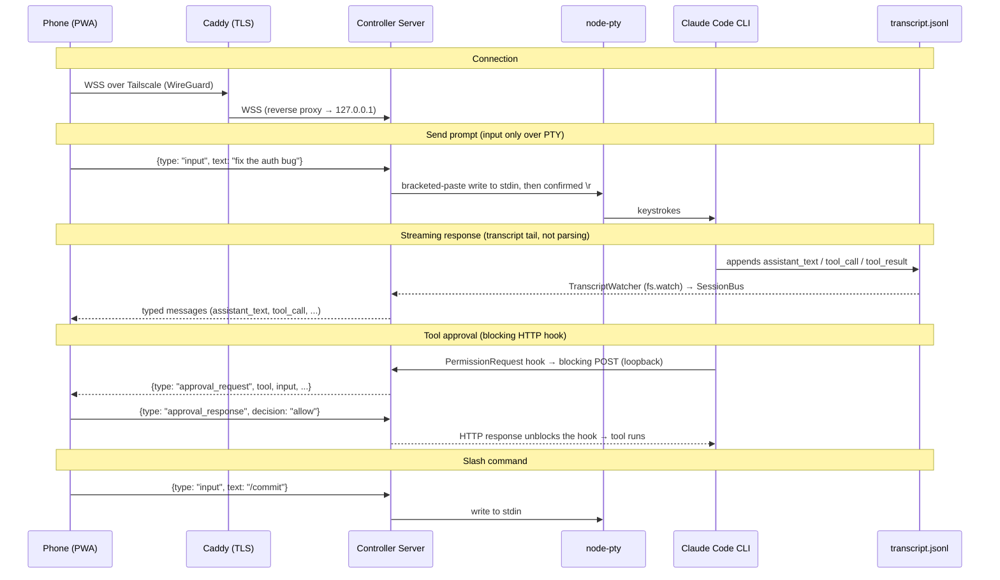
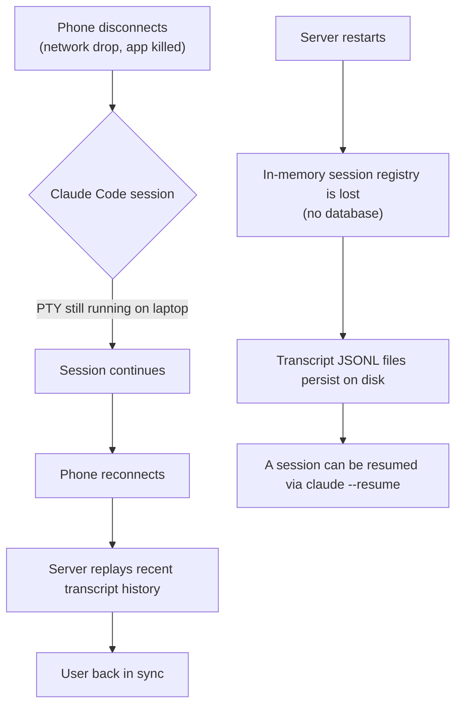
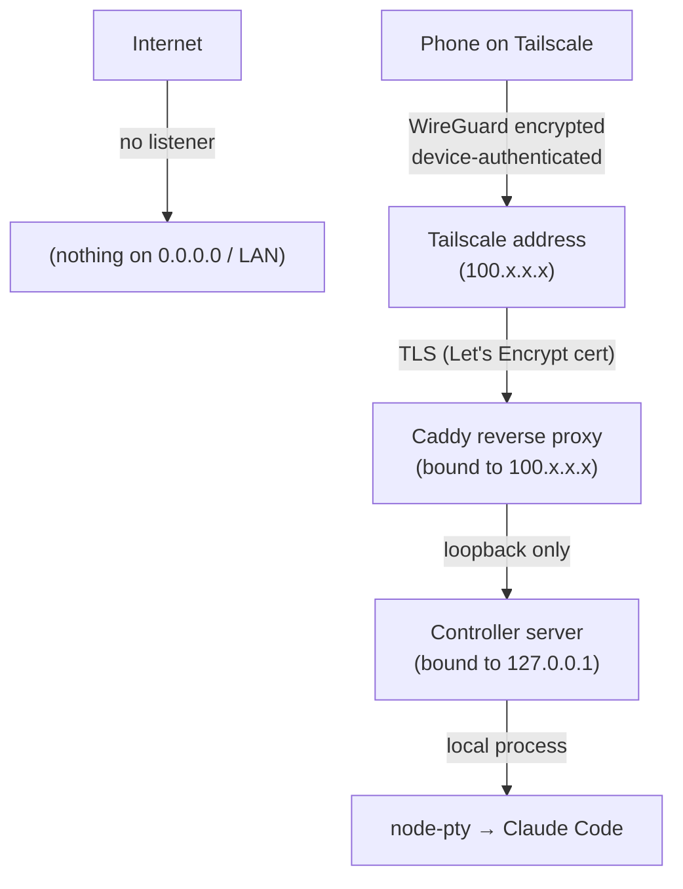

# Architecture (deep dive)

This is the excruciating-detail companion to the [README](../README.md). It covers
how the relay actually works, the wire protocol, the trickier subsystems, the
security model in full, and the decisions behind the design.

---

## Core principle: terminal relay, not an API client

Instead of calling Claude's API ourselves (which bills per token), we control the
**actual Claude Code CLI process**. From Anthropic's perspective we're
indistinguishable from you sitting at your keyboard. Consequences:

- Uses your existing **Max-plan credits** — no API key, no pay-per-token.
- **All CLI features work automatically** (slash commands, permissions, MCP, etc.).
- **Future CLI updates** are picked up for free.

The server spawns Claude Code in a PTY and consumes **two structured data
sources** — never by scraping the terminal:

1. **HTTP hooks** (control-plane: approvals, questions, compaction).
2. **The transcript JSONL** (content: assistant text, tool calls/results, prompts).

Both normalize into a per-session **`SessionBus`**, which the WS service forwards
as typed messages. **PTY stdin is used for input only**; PTY stdout is dumped to
`data/captures/<session>.raw` for debugging and is **never parsed**.

> Hard invariant: **no regex parsing of PTY output.** Content comes from hooks +
> JSONL. The `.raw` dump exists only for debugging.

---

## The two data sources

### 1. HTTP hooks

The CLI is launched with a `--settings` JSON (written to a temp file, not inline)
that registers **blocking** hooks which POST to a loopback-only endpoint:

- **`PermissionRequest`** — tool approvals **and** AskUserQuestion.
- **`PreCompact` / `PostCompact`** — compaction lifecycle.

A blocked hook **holds the CLI** until the phone responds — this is how one-tap
approvals work. The pending HTTP response is unblocked by
`hooks.service.resolveApproval()` when the phone sends `approval_response`.

`SessionStart` is **not** HTTP-capable in Claude Code, so the session id can't be
learned from a hook. Instead it's discovered by watching
`~/.claude/sessions/<pid>.json` (`session-locator.service.ts`). Because of this,
**`Session.id` resolves asynchronously** — always `await session.ready` before
relying on it.

The hooks listener binds **`127.0.0.1` only**. Claude Code's SSRF guard blocks
hook POSTs to private IPs, and there's no reason for that endpoint to be reachable
over the network. Its port defaults to `0` (OS-assigned, collision-proof) and is
configurable via `HOOKS_PORT`; the bound port is injected into the per-session
settings, so nothing external needs to know it in advance.

### 2. Transcript JSONL

Claude Code writes a structured per-session transcript at:

```
~/.claude/projects/<encoded-cwd>/<session-id>.jsonl
```

A `TranscriptWatcher` (`transcript.service.ts`) tails this file with `fs.watch`
for **all content** — assistant text, tool calls, tool results, user prompts.

---

## SessionBus and the WebSocket protocol

Every event from both sources normalizes into a per-session **`SessionBus`**
(`session-bus.service.ts`). The WS service (`ws.service.ts`) forwards bus events
to the phone as typed `ServerMessage`s, and applies inbound `ClientMessage`s.
Shared message types live in `packages/common` (`ServerMessage`, `ClientMessage`,
`SessionConfig`, `SessionInfo`, `PermissionMode`, `ClaudeModel`, `EffortLevel`).

### Data flow



---

## Input flow (and why it's confirmed)

Input flows phone → backend → PTY stdin:

1. Phone taps Send → `{type:"input"}` → backend.
2. The text is wrapped in **bracketed-paste** (`\x1b[200~…\x1b[201~`) and written
   to PTY stdin.
3. The submit `\r` is sent **separately** and **confirmed** against the transcript
   — resent if the prompt doesn't register (`Session.sendInput` /
   `submitWithConfirmation`).

The separation + confirmation exists because **a trailing `\r` coalesced into a
large paste gets stripped** by the terminal, so a naive "paste + Enter" can drop
the submit. Confirming against the transcript and resending makes it reliable.

Approvals flow back via `{type:"approval_response"}` →
`hooks.service.resolveApproval()`, which unblocks the pending `PermissionRequest`
HTTP response.

---

## AskUserQuestion relay (the keystroke-driven part)

Claude Code's `AskUserQuestion` is an interactive **ink picker**, not structured
input — so the controller renders it as a `QuestionCard` and **drives the CLI's
picker over the PTY with timed keystrokes**. This is the one place we synthesize
navigation rather than relay structured data.

- **`QuestionCard`** (frontend) renders the questions/options/preview from the
  tool-call input, collects the answer locally, and sends
  `{type:"question_response", questions, answers, cancel?}` over WS.
  `questions`/`answers` are positional; shared shapes (`QuestionSchema`,
  `AnswerEntry`) live in `common`.
- **`question.input.ts` `buildKeystrokes(...)`** is a **pure** function translating
  an answer into a `KeystrokeChunk[]` script (each chunk = bytes + optional
  `settleMs`). Navigation rules were reverse-engineered from `claude-code-source/`
  and verified against PTY captures:
  - single-select commits with `Enter` (auto-advances in a batch),
  - multi-select toggles with `Space`,
  - a preview-question note is `n` → type → **`Esc`** (not Enter) → select,
  - a batched call ends on a review screen confirmed with one `Enter`.
- **`Session.answerQuestion(chunks, confirm, toolUseId)`** paces the writes
  (`CHUNK_DELAY_MS`, honoring per-chunk `settleMs`), then confirms the answer
  landed via the bus `tool_result` for that `toolUseId`, **resending `Enter`** if a
  multi-select submit raced ink's focus flush. If it never confirms (empty script,
  or dispatch throws), `Session.failQuestion` pushes a synthetic error
  `tool_result` so the card unlocks instead of stranding the UI.
- The reducer in `MessageStream.tsx` keeps a `results` map so a `tool_result`
  **fuses onto its card** regardless of arrival order (live vs. history
  pagination), and dedupes the eager `approval_request` card against the real
  `tool_call` (the `pr:` → `toolu_` promotion).
- Pure logic is unit-tested: `buildKeystrokes`, the reducer, and the reload
  parsers (`question-result.ts`).

---

## Packages

| Package | Runtime | Responsibility | Key deps |
|---------|---------|----------------|----------|
| `packages/backend` | Node.js | Spawn the CLI via `node-pty` with injected `--settings` hooks; run the loopback hooks listener; tail the transcript; resolve the session id via `session-locator`; normalize into `SessionBus`; serve the typed WS protocol. | `node-pty`, `ws`, `dotenv` |
| `packages/frontend` | Browser | React 19 + Vite + Tailwind 4 PWA. Renders structured message cards (`AssistantMessage`, `UserMessage`, `ToolCallCard`, `ApprovalCard`, `QuestionCard`) in `MessageStream`. Connects over WS. | React 19, Vite, Tailwind 4 |
| `packages/common` | — | Shared TS types: `ServerMessage`, `ClientMessage`, `SessionConfig`, `SessionInfo`, `PermissionMode`, `ClaudeModel`, `EffortLevel`. | — |

The backend loads `packages/backend/.env` via `dotenv` (resolved relative to the
compiled file, so cwd doesn't matter). The root launcher `scripts/start.ts` (run
by `tsx` via `pnpm start`) loads the root `.env` (Caddy vars), checks
Tailscale, validates the builds, then spawns the backend + Caddy together with
clean Ctrl+C shutdown.

---

## Session persistence



- **Phone disconnect** is cheap: the PTY keeps running on the laptop; on reconnect
  the server replays the recent transcript tail.
- **Backend restart** loses the in-memory session registry (there's no database).
  Transcripts persist on disk, so a session can be resumed via `claude --resume`
  (the subscribe path can disk-discover a single session). See the Roadmap's
  *session-registry persistence* item.

---

## What we build vs. what we reuse

| Component | Build / Reuse | Notes |
|-----------|---------------|-------|
| Transport encryption | Reuse (Tailscale / WireGuard) | Peer-to-peer, end-to-end encrypted |
| TLS termination | Reuse (Caddy + tailscale cert) | Real Let's Encrypt certs for `*.ts.net` |
| Device auth & ACLs | Reuse (Tailscale) | Device approval, tailnet lock, ACLs |
| Structured CLI signals | Reuse (hooks + transcript JSONL) | No scraping — the CLI emits both |
| Controller server | **Build** | PTY, hooks listener, transcript tail, relay |
| Hooks + transcript ingestion | **Build** | Normalize into a typed `SessionBus` |
| React PWA | **Build** | Approval cards, dashboard, command palette |

---

## Security

### What we're protecting

Your personal machine with full filesystem access, potentially running Claude Code
in `bypassPermissions` mode.

### Layers (defense in depth)



1. **Network** — backend binds `127.0.0.1`, Caddy binds the Tailscale IP. Nothing
   listens on `0.0.0.0` or the LAN, so there's no public/LAN attack surface.
2. **VPN** — Tailscale requires device authentication; only approved devices join.
3. **TLS** — Caddy terminates TLS with a real cert; encrypted even within the tailnet.
4. **Application** — the WS/CORS layer **fails closed** in production: a request
   with no `Origin`, or one not in `ALLOWED_ORIGINS`, is rejected
   (`isOriginAllowed` in `utils/constants.ts`).

### Tailscale hardening checklist

- **2FA** on the identity provider — highest-leverage single control. (FIDO2 keys
  are stronger but overkill for personal use.)
- **Tailnet lock** — new devices must be signed by an existing trusted device.
- **ACLs** — only allow phone → laptop on the Caddy HTTPS port.
- **Device approval** — manually approve new devices joining the tailnet.
- **Key expiry** — keep the default 180-day expiry.

### Ingestion security

- The controller **never auto-acts** — approvals and AskUserQuestion answers
  require explicit input from the phone; a blocking hook just holds the CLI until
  the user responds.
- Ingestion is **read-only**: tailing the JSONL and receiving hook POSTs presents
  information, never synthesizes actions — the one exception is the AskUserQuestion
  keystroke relay, which only fires in response to an explicit phone answer.
- The hooks listener is **loopback-only** behind Claude Code's SSRF guard.
- CLI updates changing the JSONL entry shape or hook payload schema can break
  ingestion (a maintenance burden, not a security risk).

### Risks that exist regardless (Claude Code's own surface)

These apply whether you use this tool, SSH, or sit at the laptop — **this tool does
not increase them**:

- Prompt injection via Claude's output
- Terminal escape sequences
- Keystroke interception (keyloggers)
- Resource exhaustion from spawning processes

### Phone as the weakest link

If the phone is unlocked and stolen, the attacker has tailnet access and possibly a
live session. Mitigations: a strong device passcode (not just biometric), a short
auto-lock timeout, remote wipe, and a PWA idle timeout (see Roadmap).

---

## Key decisions

- **No Agent SDK** — it requires API keys with pay-per-token billing and can't use
  Max-plan credits. (One report: $1,800 in surprise charges in 2 days.)
- **No Vercel AI SDK** — it calls LLM APIs directly. We don't call Claude's API at
  all — we control the CLI, which does that internally.
- **Anthropic's third-party restrictions don't apply** — the Jan–Apr 2026
  crackdown targeted tools piggybacking on claude.ai OAuth subscriptions. We
  control a local CLI authenticated by the user's own login.
- **Approach A — direct PTY** (a 3-entity SSH bridge was rejected). If WSS + the
  tailnet is compromised, SSH keys on the same machine are likely compromised too;
  SSH adds setup burden without meaningful security gain for a same-machine deploy.
- **Hosted Tailscale over self-hosted Headscale** — see the ADR in the project's
  decision log. (Headscale needs a public VPS + domain + DNS-01 cert flow; hosted
  Tailscale is free for personal use with zero servers. Migration to Headscale
  later is low-effort since the clients are identical.)
- **No database** — in-memory state; sessions don't survive a backend restart
  (transcripts persist on disk).
- **pnpm monorepo** — three packages; shared types in `common`.

---

## Tech stack

| Layer | Choice | Rationale |
|-------|--------|-----------|
| Runtime | Node.js | Required by `node-pty`; CLI spawned as a child process |
| Monorepo | pnpm workspaces | 3 packages — `backend`, `frontend`, `common` |
| Lint/format | Biome | Single tool, no ESLint/Prettier |
| Launcher | tsx (`scripts/start.ts`) | Cross-platform; `pnpm start` |
| PTY | node-pty | The standard (VS Code uses it) |
| WebSocket | ws | Fast, well-maintained |
| Frontend | React 19 + Vite | Fast dev, good PWA support |
| Styling | Tailwind CSS 4 | Mobile-responsive |
| Transport | Tailscale (user-provided) | WireGuard VPN, free personal tier |
| TLS | Caddy (user-provided) | Auto-certs from the local Tailscale daemon |
| State | In-memory | No database; transcripts persist via the CLI |

---

## Reference implementations

Prior art studied while designing the relay:

| Tool | What we learn from it |
|------|----------------------|
| [ttyd](https://github.com/tsl0922/ttyd) | Web terminal bound to a specific interface; auth patterns |
| [Wetty](https://github.com/butlerx/wetty) | Node.js + xterm.js + WebSocket architecture |
| [GoTTY](https://github.com/sorenisanerd/gotty) | Random-URL security, read-only defaults |

---

## Invariants (don't break these)

- **Never** use the Agent SDK or call Claude's API directly — it would incur
  pay-per-token billing instead of Max-plan credits.
- **No regex parsing of PTY output** — content comes from hooks + JSONL; the `.raw`
  dump is debug-only.
- **Hooks listener is loopback-only** (`127.0.0.1`) — Claude Code's SSRF guard
  blocks private IPs.
- **The backend binds loopback**; only Caddy faces the tailnet.
- **Shared types go in `packages/common`** — both backend and frontend import them.

## Reference: Claude Code source

`claude-code-source/` (gitignored, not built) contains a copy of the CLI source
used to understand hook payloads, the JSONL entry shape, and `--settings` handling:

- `src/main.tsx` — `--settings` JSON parsing
- `src/utils/hooks/execHttpHook.ts` — HTTP hook POST contract
- `src/entrypoints/sdk/coreSchemas.ts` — hook event payload schemas
- `src/schemas/hooks.ts` — settings.json hook config shape (zod)
